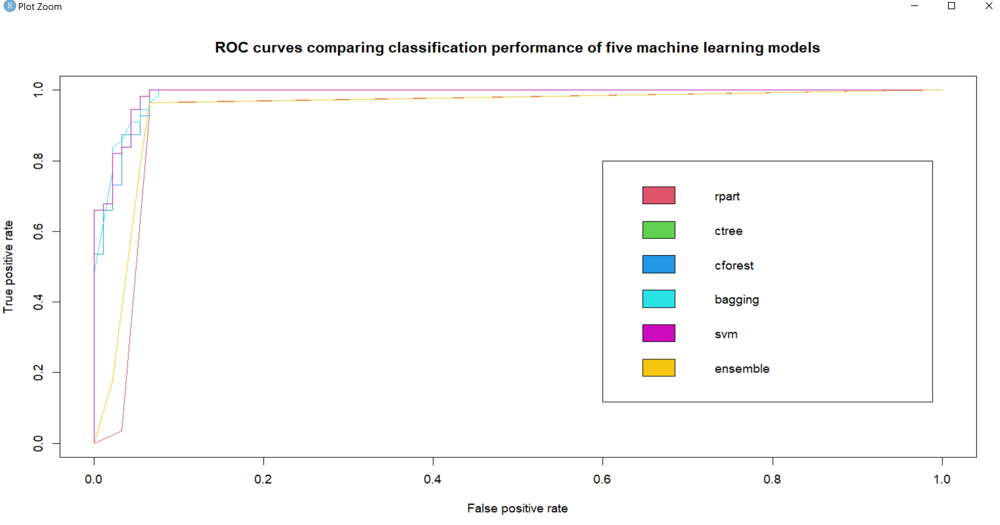

# Ensemble Classification Demo

This project is a demonstration of the concept of Ensemble Classification in R using the BreastCancer dataset accessed through the "mlbench" package

Example R code was provided as part of the TBANLT 560 class at UW. 

Five models were created to feed into the overall ensemble model:

1. Decision Tree *- rpart*
2. Conditional Inference Trees *- party*
3. Random Forest *- party*
4. Bagging *- ipred*
5. Support Vector Machine *- e1071*

The goal of each classification model is to predict whether an observation is **benign** or **malignant**.

Ensemble results were calculated by majority vote.

The ROC curves for all models is shown below to compare accuracy results.

R code is provided in the Rmd file, and the output in the pdf.